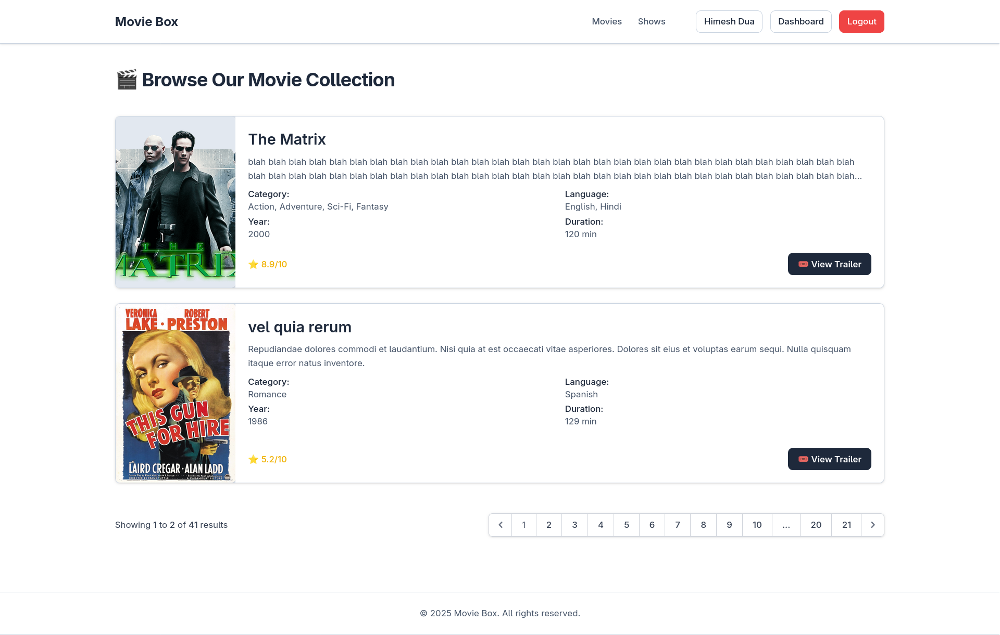
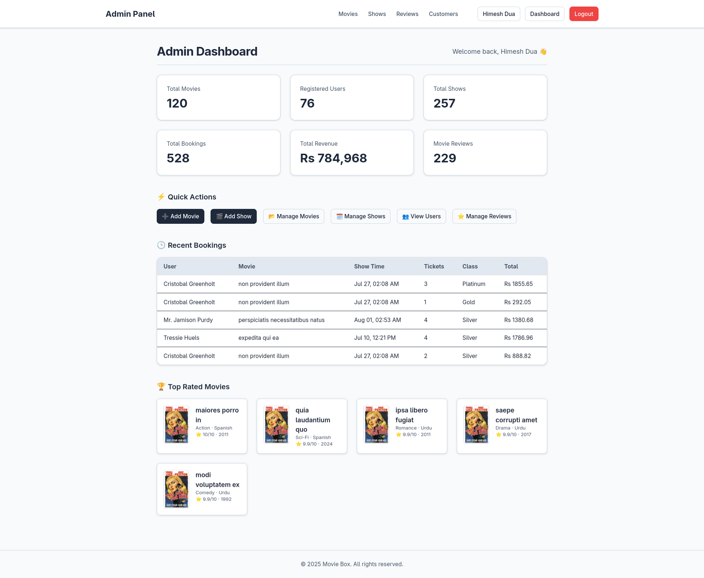
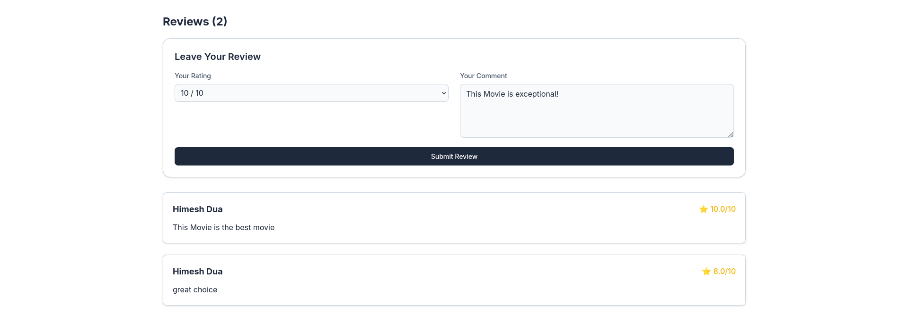

<h1 align="center">MovieBox - Online Movie Ticket Booking System</h1>

<p align="center">
  Built with Laravel, Tailwind CSS, and Blade UI <br/>
  Developed solo in 8 days as a 2nd semester term-end project at Aptech.
</p>

<p align="center">
  <a href="https://github.com/himeshdua/moviebox"></a>
  <a href="https://github.com/himeshdua/moviebox"></a>
</p>

---

## 🎥 About MovieBox

**MovieBox** is a fully functional movie ticket booking system built using **Laravel 10**. It allows users to browse currently showing and top-rated movies, watch trailers, read and post reviews, and book movie tickets — all through a responsive, user-friendly interface.

This project was developed as a **2nd semester term-end project at Aptech** and built entirely by one person within just **8 days**. It demonstrates full-stack capability, including admin management, role-based access control, database design, and clean UI components.

---

## 🚀 Features

-   🎬 Movie Browse with posters, categories, and ratings
-   🎞 Trailer preview and short descriptions
-   ⭐ Community reviews with ratings
-   🧾 Ticket booking with multiple class pricing (**Silver, Gold, Platinum**)
-   🧒 Discounted pricing for kids (3–12 years)
-   📱 Responsive and mobile-friendly design using **Tailwind CSS**
-   🔐 User authentication (**Laravel Auth**) and protected routes
-   📊 Admin dashboard with total revenue, user, movie, and show stats
-   🎛 Admin controls for adding/updating/deleting movies and shows
-   🧾 Booking list with quantities, dates, and total pricing

---

## ⚙️ Tech Stack

-   **Framework**: Laravel 10 (MVC architecture)
-   **Frontend**: Blade Templating, Tailwind CSS
-   **UI Libraries**: ShadCN-inspired components, BadtzUI, PrismUI
-   **Database**: MySQL using Eloquent ORM
-   **Authentication**: Laravel built-in Auth + Middleware
-   **Deployment**: Vite + Artisan + PHP server

---

## 📁 Folder Structure

-   `moviebox/`
    -   `app/`
        -   `Http/Controllers/` (MovieController, ShowController, BookingController, etc.)
        -   `Models/` (Movie, Show, Booking, User, Review)
    -   `resources/views/` (Blade templates)
    -   `routes/web.php` (All web routes)
    -   `public/posters/` (Uploaded poster images)
    -   `database/migrations/` (Tables: users, movies, shows, bookings, reviews)
    -   `.env` (Environment variables) # Environment variables

---

## 🖼 Screenshots

-   **🎬 Movie Listings Page**
    

-   **📆 Show Booking Form**
    

-   **📊 Admin Dashboard**
    

-   **💬 Review Submission**
    

---

## 🧪 How to Run Locally

Follow the steps below to set up and run MovieBox on your local machine.

1.  **Clone the repository and navigate to the project directory:**

    ```bash
    git clone https://github.com/himeshdua/moviebox.git
    cd MovieBox
    ```

2.  **Install dependencies:**

    ```bash
    composer install
    npm install
    ```

3.  **Set up the `.env` file:**
    Copy the example environment file and configure your database settings.

    ```bash
    cp .env.example .env
    ```

4.  **Generate Application Key & Configure Database:**
    Copy the example environment file, then run the command to generate your application key. After this, configure your MySQL database credentials in the `.env` file.

    ```
    php artisan key:generate
    ```

5.  **Run migrations and seed the database:**
    This command will create the necessary tables and populate them with sample data.

    ```bash
    php artisan migrate --seed
    ```

6.  **Start the local development server:**
    ```bash
    php artisan serve
    ```
    Visit `http://127.0.0.1:8000` in your browser to view the application.

---

## 🌟 Project Highlights

-   Solo-built in just **8 days**.
-   Developed as a final project for **Aptech's 2nd semester**.
-   Full **CRUD** (Create, Read, Update, Delete) functionality for movies and shows.
-   Clean database schema and **Eloquent relationships**.
-   No external UI kits—fully customized **Tailwind CSS** components.
-   Light/dark mode compatible using CSS variables.

---

## 🧱 Tables Overview

The database is structured with the following key tables:

-   `users`: Stores user information (id, name, email, password, role, created_at).
-   `movies`: Contains details about each movie (id, title, description, year, poster, trailer_url, category, language, rating, duration).
-   `shows`: Links movies to showtimes and locations (id, movie_id, city, location, show_date, show_time, price_silver, price_gold, price_platinum).
-   `bookings`: Records ticket bookings (user_id, show_id, class_type, quantity, is_kid, total_price).
-   `reviews`: Manages user reviews and ratings for movies (user_id, movie_id, comment, rating, created_at).

---

## 🔮 Future Enhancements

-   **💳 Payment gateway integration** (e.g., Stripe, JazzCash)
-   **🪑 Seat selection layout**
-   **📧 Email ticket confirmations**
-   **🗺 Multi-city theatre map support**
-   **📱 PWA or mobile app companion**

---

## 👨‍💻 Author

**Himesh Dua**

17 y/o Full Stack Developer from Karachi, Pakistan

-   **Portfolio**: [himeshdua.vercel.app](https://himeshdua.vercel.app)
-   **GitHub**: [@himeshdua](https://github.com/himeshdua)
-   **Email**: himeshdua22@gmail.com

---

## 📝 License

This project is open-sourced under the **MIT license**.

```

```
